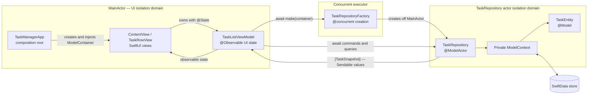

# TaskManager Architecture

## Scope

This document describes the implementation on the `codex/chatgpt5.6-sol-high` branch. The app is deliberately small: it persists tasks, lists them newest first, and supports adding, completing, and deleting them.

The interesting part is not the feature set. It is the concurrency architecture required to keep SwiftData work away from the main actor under Swift 6 strict concurrency without passing non-Sendable persistence objects between isolation domains.

## Goals

The design has six primary goals:

1. Run SwiftData fetches and writes on a background-bound `@ModelActor`.
2. Keep SwiftUI and all observable UI state on `MainActor`.
3. Never pass a `ModelContext` or live `@Model` instance between actor isolation domains.
4. Use `async`/`await` and actor isolation instead of Grand Central Dispatch or unchecked Sendable conformances.
5. Keep the MVVM layers explicit and proportionate to a small task-list app.
6. Make the persistence and view-model behavior testable with an in-memory SwiftData container.

Non-goals include live synchronization with other processes, CloudKit, pagination, multiple lists, relationships, and an abstract persistence framework.

## Architecture at a glance



The `ModelContainer` is shared because SwiftData declares it Sendable. Each isolation domain must still own its own context. The `TaskRepository` therefore uses the `ModelContext` synthesized for its `@ModelActor`; that context never leaves the actor.

## Architectural invariants

These rules are more important than the individual type names:

1. `TaskRepository` is the only production module that fetches, inserts, mutates, deletes, or saves `TaskEntity` values.
2. `TaskRepository.modelContext` never leaves the repository actor.
3. A live `TaskEntity` never leaves the repository actor.
4. Values crossing into the repository are Sendable primitives or collections: `String`, `UUID`, and `[UUID]`.
5. Values crossing back are immutable `TaskSnapshot` values or Sendable errors.
6. Observable UI state is mutated only by `TaskListViewModel` on `MainActor`.
7. The repository actor is created from an explicitly concurrent function, not from main-actor initialization.
8. A successful write is saved before refreshed snapshots are published to the UI.

Violating invariants 2, 3, or 7 would undermine the central concurrency design even if the project continued to compile.

## Module map

| Module | Interface | Responsibility | Isolation |
|---|---|---|---|
| [`TaskManagerApp`](TaskManager/TaskManagerApp.swift) | SwiftUI `App` lifecycle | Create the persistent container and compose the root view | Main actor by project default |
| [`ContentView`](TaskManager/ContentView.swift) | `init(modelContainer:)` and SwiftUI `body` | Own view state, render list states, bridge synchronous UI actions to async work | Main actor through `View` |
| [`TaskRowView`](TaskManager/TaskRowView.swift) | `TaskSnapshot` plus a toggle action | Render one accessible task row | Main actor through `View` |
| [`TaskListViewModel`](TaskManager/TaskListViewModel.swift) | Async load and mutation methods plus read-only UI state | Coordinate repository work and publish UI state | Explicit `@MainActor` |
| [`TaskRepositoryFactory`](TaskManager/TaskRepositoryFactory.swift) | `make(modelContainer:) async` | Establish the repository's background executor affinity | `nonisolated`, with `@concurrent` creation |
| [`TaskRepository`](TaskManager/TaskRepository.swift) | Fetch, add, toggle, and delete methods | Hide SwiftData context ownership, persistence operations, sorting, and entity-to-snapshot mapping | Independent `@ModelActor` |
| [`TaskEntity`](TaskManager/TaskEntity.swift) | Persisted fields and initializer | SwiftData storage representation | Explicitly `nonisolated` |
| [`TaskSnapshot`](TaskManager/TaskSnapshot.swift) | Immutable task fields | Safe view-facing representation | `nonisolated` and `Sendable` |
| [`TaskRepositoryError`](TaskManager/TaskRepositoryError.swift) | Localized persistence-domain failures | Carry understandable errors across isolation domains | `nonisolated` and `Sendable` |

Each significant type has its own file. This keeps the project navigable and prevents unrelated view, state, persistence, and concurrency concerns from accumulating in one source file.

## Concurrency model

### Swift 6 settings

The targets use:

```text
SWIFT_VERSION = 6.0
SWIFT_STRICT_CONCURRENCY = complete
SWIFT_APPROACHABLE_CONCURRENCY = YES
SWIFT_DEFAULT_ACTOR_ISOLATION = MainActor   // app target
```

Main-actor-by-default is a good default for an executable SwiftUI target because most application code is UI-bound. Background work is then an explicit opt-out rather than an accidental property of an unannotated async method.

The explicit `SWIFT_STRICT_CONCURRENCY = complete` setting documents the intent for every target. Swift 6 language mode already makes data-race checking strict, but retaining the explicit setting makes the project's concurrency posture obvious in Xcode and in source review.

### Why `@ModelActor` alone is insufficient

`@ModelActor` gives `TaskRepository` serialized access to its SwiftData context, but actor isolation alone does not mean “background.” The executor affinity of the synthesized SwiftData context is established when the actor is created. Creating it directly from `TaskManagerApp`, a SwiftUI view, or the main-actor view-model initializer risks binding that persistence work to the main executor.

The factory makes actor creation itself concurrent:

```swift
import SwiftData

nonisolated enum TaskRepositoryFactory {
    /// `@ModelActor` uses the executor on which it is created. Creating it from
    /// an explicitly concurrent function keeps all SwiftData work off MainActor.
    @concurrent
    static func make(modelContainer: ModelContainer) async -> TaskRepository {
        TaskRepository(modelContainer: modelContainer)
    }
}
```

This is a small module with high leverage: its single-method interface hides a subtle but essential construction invariant from every caller. Without it, each caller would need to understand SwiftData executor affinity.

`@concurrent` is preferred over `Task.detached`. It expresses the required executor hop directly, retains normal async/await call structure, and avoids detached-task lifetime and priority semantics.

### Bridging asynchronous construction into the view model

Swift initializers cannot be asynchronous, so the main-actor view model stores a task representing eventual repository availability:

```swift
private let repositoryTask: Task<TaskRepository, Never>

init(modelContainer: ModelContainer) {
    repositoryTask = Task {
        await TaskRepositoryFactory.make(modelContainer: modelContainer)
    }
}
```

The outer `Task` inherits the view model's main-actor context. Its call to the factory then explicitly hops to the concurrent executor. The result is an actor reference, which is safe to retain and call from `MainActor` using `await`.

The creation task cannot fail because the already-created `ModelContainer` is the only input and the synthesized actor initializer is non-throwing. Storing one task also ensures that concurrent callers all await the same repository instance rather than racing to create multiple actors and contexts.

### Isolation crossings

A repository method is synchronous within its own actor:

```swift
func fetchTasks() throws -> [TaskSnapshot] {
    let descriptor = FetchDescriptor<TaskEntity>(
        sortBy: [SortDescriptor(\TaskEntity.createdAt, order: .reverse)]
    )

    return try modelContext.fetch(descriptor).map { task in
        TaskSnapshot(
            id: task.id,
            title: task.title,
            createdAt: task.createdAt,
            isCompleted: task.isCompleted
        )
    }
}
```

The caller still writes `try await repository.fetchTasks()` because calling an actor-isolated method from `MainActor` requires an actor hop. The non-Sendable `FetchDescriptor`, `ModelContext`, and fetched entities are all created and consumed inside `TaskRepository`. Only `[TaskSnapshot]` crosses back.

## Persistence model

### `TaskEntity`: the storage representation

```swift
@Model
nonisolated final class TaskEntity {
    var id: UUID
    var title: String
    var createdAt: Date
    var isCompleted: Bool

    init(
        id: UUID = UUID(),
        title: String,
        createdAt: Date = .now,
        isCompleted: Bool = false
    ) {
        self.id = id
        self.title = title
        self.createdAt = createdAt
        self.isCompleted = isCompleted
    }
}
```

`@Model` is used because `TaskEntity` is the persisted schema, not because it is suitable UI state. SwiftData models are context-associated mutable reference objects. Passing them directly to the view model would expose persistence lifetime and isolation rules throughout the UI.

The app target defaults declarations to `MainActor`. `nonisolated` opts the model type out of that default so the independent `TaskRepository` actor can construct and access it. This does not make model instances freely Sendable; repository ownership is still required.

A UUID is stored as domain identity rather than exposing SwiftData's `PersistentIdentifier` to the view layer. That keeps view identity stable and persistence-framework details out of view-model commands. The tradeoff is that mutations must resolve the UUID to the corresponding entity with a query.

### `TaskSnapshot`: the transfer and presentation representation

```swift
nonisolated struct TaskSnapshot: Identifiable, Equatable, Sendable {
    let id: UUID
    let title: String
    let createdAt: Date
    let isCompleted: Bool
}
```

The snapshot is immutable because the UI does not own persistence mutations. A row can render it and identify it, but completing a task must go back through the view model and repository.

This gives the actor seam a simple interface:

- inputs are IDs or validated scalar values;
- outputs are complete immutable values;
- no context ownership rules leak into SwiftUI;
- Swift 6 can prove the crossing is Sendable without `@unchecked Sendable`.

Using separate entity and snapshot representations incurs a small mapping cost, but buys much stronger locality: all SwiftData-specific knowledge remains in the repository.

## Repository design

`TaskRepository` is the persistence module. Its interface consists of four operations:

```text
@ModelActor
actor TaskRepository {
    fetchTasks() -> [TaskSnapshot]
    addTask(title) -> [TaskSnapshot]
    toggleTask(id) -> [TaskSnapshot]
    deleteTasks(ids) -> [TaskSnapshot]
}
```

Behind that interface it owns:

- the private model context;
- fetch descriptors and predicates;
- newest-first ordering;
- model lookup;
- insert, update, delete, and save behavior;
- conversion from persistent entities to Sendable snapshots.

This is a reasonably deep module: callers learn four task-oriented operations and do not need to learn SwiftData context rules.

### Why mutations return the refreshed list

Each write saves and then calls `fetchTasks()`:

```swift
func addTask(title: String) throws -> [TaskSnapshot] {
    modelContext.insert(TaskEntity(title: title))
    try modelContext.save()
    return try fetchTasks()
}
```

The same pattern is used for toggle and delete. This was chosen over optimistic local array mutation because it gives the UI one authoritative, correctly sorted view of persisted state after every successful command. The view model cannot accidentally drift from the store or duplicate repository ordering rules.

For this small list, the additional fetch is an acceptable clarity tradeoff. For a large or paginated data set, mutations should return only the affected snapshot or use a query result type that describes the current page.

### Lookup and deletion choices

Toggle uses a targeted predicate and `fetchLimit = 1`. Delete currently fetches all stored tasks, filters them against a `Set<UUID>`, deletes matches, saves once, and refreshes:

```swift
func deleteTasks(ids: [UUID]) throws -> [TaskSnapshot] {
    let identifiers = Set(ids)
    let storedTasks = try modelContext.fetch(FetchDescriptor<TaskEntity>())

    for task in storedTasks where identifiers.contains(task.id) {
        modelContext.delete(task)
    }

    try modelContext.save()
    return try fetchTasks()
}
```

Saving once makes a multi-row deletion one repository operation. The full-store read is intentionally simple for the current scale, but it is the main persistence inefficiency. A larger app should use a targeted predicate, batch deletion, or persistent identifiers.

### Why there is no repository protocol

The repository's concrete actor interface is used directly. This is deliberate, not an omission hidden by the architecture:

- there is one production persistence adapter;
- tests can run the real adapter against SwiftData's in-memory container;
- no alternate store or deterministic failure adapter is currently required;
- a protocol with one adapter would be a hypothetical seam and add indirection without varying behavior.

SwiftData is a local-substitutable dependency: its in-memory configuration provides a fast stand-in while exercising the same repository implementation. If the app later needs deterministic failure testing, a preview fake, CloudKit-independent behavior, or a second persistence adapter, that would justify introducing a small Sendable repository interface and injecting an adapter into the view model.

## View-model design

### Main-actor observable state

```swift
@MainActor
@Observable
final class TaskListViewModel {
    private(set) var tasks: [TaskSnapshot] = []
    private(set) var isLoading = false
    private(set) var isPerformingMutation = false
    private(set) var errorMessage = ""
    var isShowingError = false
}
```

`@Observable` is the modern Observation model for SwiftUI and avoids legacy `ObservableObject`, `@Published`, and `@StateObject` machinery. Explicit `@MainActor` documents that all published state belongs to the UI isolation domain even though the app target also defaults to `MainActor`.

Most state has `private(set)` so views can observe it but cannot violate view-model invariants. `isShowingError` remains writable because SwiftUI's alert binding dismisses by setting it to `false`.

### Loading and cancellation

```swift
func loadTasks() async {
    guard !isLoading else { return }

    isLoading = true
    defer { isLoading = false }

    do {
        let repository = await repositoryTask.value
        let fetchedTasks = try await repository.fetchTasks()
        try Task.checkCancellation()
        tasks = fetchedTasks
    } catch is CancellationError {
        return
    } catch {
        present(error)
    }
}
```

SwiftUI starts this work with `.task`, so the task is automatically cancelled when the view disappears. SwiftData's synchronous fetch inside the actor is not itself cooperatively cancellable; the explicit check after the actor hop prevents a cancelled load from publishing stale results when it returns.

Cancellation is not shown as an error because it is a normal lifecycle event. The loading guard prevents duplicate loads from racing the single loading flag.

### Mutation serialization

```swift
private func beginMutation() -> Bool {
    guard !isPerformingMutation else { return false }
    isPerformingMutation = true
    return true
}
```

Each mutation calls this before its first suspension point and resets the flag with `defer`. Because the view model is main-actor isolated, checking and setting the flag is serialized. A rapid second action cannot start another mutation while the first awaits persistence.

The view also disables its list and displays a progress overlay while the flag is true. The view-model guard remains necessary because UI disabling is presentation behavior, not a correctness guarantee.

Mutation tasks have a different cancellation policy from the initial read. They are started by explicit user actions and are allowed to finish once persistence begins; cancelling only the UI continuation after a save could leave the displayed snapshots behind the durable state. The actor serializes the write, and the returned refresh reconciles the view model with the completed transaction. A production app with long-running writes could model pre-commit cancellation explicitly inside the repository.

### Add returns success

`addTask(title:)` returns `Bool` so the view clears user input only after persistence succeeds:

```swift
Task {
    if await viewModel.addTask(title: title) {
        newTaskTitle = ""
    }
}
```

This keeps recoverable user input on screen when a write fails. The view model also trims and validates the title, so persistence never receives a blank task even if another caller bypasses the button's disabled state.

### Error translation

The repository defines a localized, Sendable domain error:

```swift
nonisolated enum TaskRepositoryError: LocalizedError, Sendable {
    case taskNotFound

    var errorDescription: String? {
        switch self {
        case .taskNotFound:
            "The task no longer exists."
        }
    }
}
```

The repository reports persistence-domain facts; the view model translates any error into alert state. This keeps SwiftData errors out of view code and ensures user-triggered failures are surfaced rather than logged or swallowed.

## SwiftUI composition and data flow

### Composition root

`TaskManagerApp` creates the durable `ModelContainer` once:

```swift
@main
struct TaskManagerApp: App {
    private let modelContainer: ModelContainer

    init() {
        do {
            let configuration = ModelConfiguration(isStoredInMemoryOnly: false)
            modelContainer = try ModelContainer(
                for: TaskEntity.self,
                configurations: configuration
            )
        } catch {
            fatalError("Unable to create model container: \(error)")
        }
    }

    var body: some Scene {
        WindowGroup {
            ContentView(modelContainer: modelContainer)
        }
        .modelContainer(modelContainer)
    }
}
```

Container creation failure is treated as fatal because the app cannot satisfy its persistence invariant or offer its only feature without a store. This is an appropriate fail-fast case rather than a recoverable button-action error.

The container is both injected into `ContentView` and registered in the SwiftUI environment. Injection is required to initialize the view model. Environment registration keeps the scene correctly configured for previews or future SwiftData-aware child views, although the current production views intentionally perform no direct `@Query` or `modelContext` operations.

### View ownership

```swift
struct ContentView: View {
    @State private var viewModel: TaskListViewModel
    @State private var newTaskTitle = ""

    init(modelContainer: ModelContainer) {
        _viewModel = State(
            initialValue: TaskListViewModel(modelContainer: modelContainer)
        )
    }
}
```

`ContentView` owns the view model with `@State`, giving the reference stable identity across view recomputation. The text-field value is also view-owned because it is transient presentation state, not application state.

Inside `body`, a local `@Bindable` projection enables normal SwiftUI bindings without changing ownership:

```swift
@Bindable var viewModel = viewModel
```

### Bridging button actions into async work

SwiftUI button actions are synchronous. Small `Task` closures bridge them to async view-model methods:

```swift
private func toggleTask(id: UUID) {
    Task {
        await viewModel.toggleTask(id: id)
    }
}
```

Because these tasks originate from a main-actor-isolated view, they inherit `MainActor`. The view model remains responsible for the actor hop into persistence. No `MainActor.run`, dispatch queue, or detached task is necessary.

### Dedicated row view

`TaskRowView` receives only an immutable snapshot and an action. It does not know about SwiftData or the view model. Its button retains a textual accessibility label even though the visual style is icon-only:

```swift
Button(
    task.isCompleted ? "Mark Incomplete" : "Mark Complete",
    systemImage: task.isCompleted ? "checkmark.circle.fill" : "circle",
    action: toggle
)
.labelStyle(.iconOnly)
```

Extracting the row gives SwiftUI a small stable view tree and keeps list composition separate from row presentation.

## Query and refresh strategy

The app intentionally does not use SwiftUI's `@Query`. `@Query` is convenient for main-context, live-updating views, but it would place persistence knowledge in the view and obscure the explicit background actor hop that this project is designed to demonstrate.

Instead:

1. The view starts `loadTasks()` with `.task`.
2. The view model awaits `TaskRepository.fetchTasks()`.
3. The repository creates the descriptor and fetches on its actor.
4. The repository maps entities to snapshots.
5. The view model publishes the result on `MainActor`.

All application writes also flow through the repository and return refreshed snapshots, so the list stays current for changes made by this process. The cost is that this is explicit refresh, not live observation. Writes from another process, another model context, or future CloudKit synchronization would require an additional invalidation or history-observation mechanism.

## Testing strategy

Tests use Swift Testing and an in-memory `ModelContainer`:

```swift
private func makeContainer() throws -> ModelContainer {
    let configuration = ModelConfiguration(isStoredInMemoryOnly: true)
    return try ModelContainer(
        for: TaskEntity.self,
        configurations: configuration
    )
}
```

The repository test exercises the production actor through its task-oriented interface and verifies fetch, add, toggle, and delete outcomes. The view-model test verifies trimming, published snapshots, and mutation flow while running on `MainActor`.

This strategy favors a local-substitutable real dependency over mocks. It proves that SwiftData descriptors, saves, actor hops, and snapshot conversion work together. The current suite is intentionally small; production expansion should add failure translation, not-found behavior, cancellation, overlapping action, ordering, and multi-delete cases.

## Rejected alternatives

### Pass `TaskEntity` directly to SwiftUI

Rejected because it spreads context lifetime, mutation ownership, and Sendable problems into every view and view-model method. Snapshots make the actor seam explicit and compiler-checkable.

### Pass `ModelContext` into the view model

Rejected because a context cannot be shared across concurrency domains. The repository owns its synthesized context, while callers share only the Sendable container during construction.

### Use `@Query` in `ContentView`

Rejected because it couples the view to SwiftData's main-context query behavior and bypasses the explicit background repository architecture.

### Create `TaskRepository` directly in the app or view-model initializer

Rejected because actor creation context determines the SwiftData executor affinity. The `@concurrent` factory is required to make background construction intentional.

### Use `Task.detached` or `DispatchQueue`

Rejected because `@concurrent`, actor isolation, and async/await express the concurrency topology directly. Detached tasks lose inherited task context, while dispatch queues bypass Swift's isolation checking.

### Add a repository protocol immediately

Rejected because there is currently one adapter and the in-memory SwiftData configuration tests it locally. A protocol becomes valuable when a second adapter or deterministic fake is actually required.

### Update the UI optimistically

Rejected for the initial implementation because returning persisted, sorted snapshots minimizes state-reconciliation logic. The app trades extra reads for a smaller and more reliable state interface.

## Known tradeoffs and extension points

### Current tradeoffs

- Mutations perform a complete refresh after saving.
- Multi-delete scans all stored tasks before deleting matches.
- Explicit refresh does not observe external store changes automatically.
- The concrete repository dependency makes forced error and cancellation tests harder.
- The repository creation task is retained after completion and is not coupled to an individual caller's cancellation.
- Error message and alert visibility are separate observable properties.
- The initial-load UI distinguishes loading from empty data but does not provide a dedicated retry state after an error.

These are acceptable for the sample's scale, but they are documented so they are not mistaken for invisible guarantees.

### Scaling the query interface

If filtering, search, sorting, or pagination are added, callers should send a small immutable `TaskQuery: Sendable` value. `TaskRepository` should construct `FetchDescriptor` from that value inside its actor. A descriptor itself should not become part of the repository interface.

### Adding a real persistence seam

If a second adapter becomes necessary, introduce a Sendable task-store interface at the view-model seam. Keep SwiftData types out of it:

```swift
nonisolated protocol TaskStore: Sendable {
    func fetchTasks() async throws -> [TaskSnapshot]
    func addTask(title: String) async throws -> [TaskSnapshot]
    func toggleTask(id: UUID) async throws -> [TaskSnapshot]
    func deleteTasks(ids: [UUID]) async throws -> [TaskSnapshot]
}
```

`TaskRepository` would be the production adapter and an in-memory actor could be the deterministic test adapter. This seam should be introduced only when both adapters provide real value.

### Scaling persistence operations

For larger stores:

- add an index or uniqueness constraint appropriate to the storage configuration;
- use targeted predicates or batch deletion instead of a full scan;
- return affected snapshots rather than the complete list;
- introduce pagination and a query-specific result type;
- observe persistent history or external invalidation when there are multiple writers.

## Decision summary

| Decision | Rationale | Cost |
|---|---|---|
| Main actor by default | Safe, natural default for a SwiftUI executable | Background types need explicit opt-out |
| Explicit `@MainActor` view model | Documents and enforces UI-state ownership | Slight annotation redundancy |
| `nonisolated @Model` entity | Allows the independent data actor to use the schema | Requires disciplined context ownership |
| `@ModelActor` repository | Serializes SwiftData context access and hides persistence details | Cross-actor calls require `await` |
| `@concurrent` repository factory | Establishes genuinely background-bound actor creation | Requires asynchronous construction bridge |
| Immutable Sendable snapshots | Prevents models and contexts crossing actors | Requires entity-to-value mapping |
| UUID domain identity | Keeps SwiftData identity out of UI interfaces | Mutations require lookup queries |
| Concrete repository | Avoids a hypothetical single-adapter abstraction | Harder to inject deterministic failures |
| In-memory SwiftData tests | Exercises the production persistence adapter | Slower and less controllable than pure fakes |
| Full refresh after mutation | Store remains authoritative and sorting stays centralized | Additional reads after writes |
| Explicit async query instead of `@Query` | Makes the background hop and MVVM ownership visible | No automatic observation of external changes |
| `@State` view-model ownership | Stable Observation identity across view updates | View initializer needs the container dependency |

The architecture is intentionally strict at concurrency seams and deliberately modest elsewhere. Its core value is that each isolation domain owns the state appropriate to it: SwiftData owns live models inside `TaskRepository`, the view model owns Sendable UI state on `MainActor`, and SwiftUI renders values without learning persistence concurrency rules.
