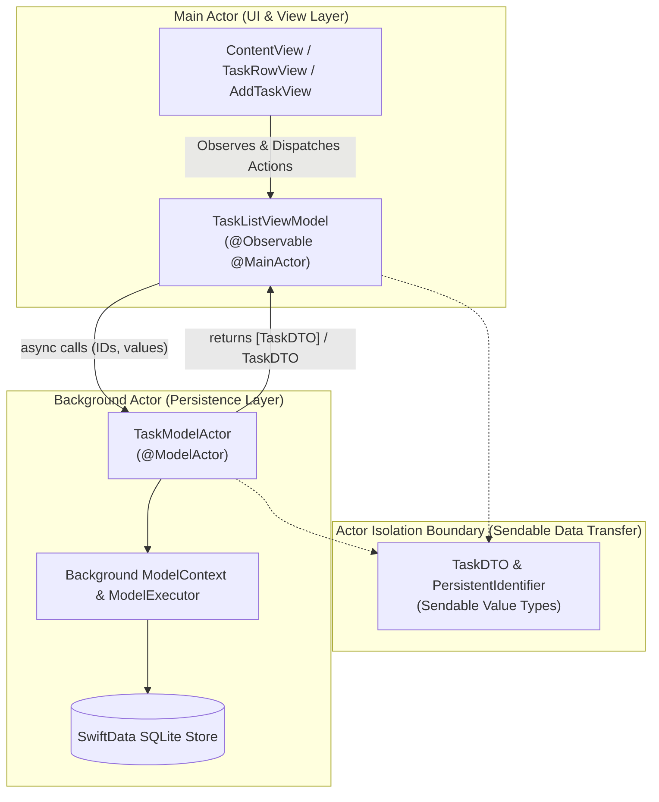

# TaskManager Architecture & Swift 6 Concurrency Guide

## 1. Executive Overview

This project demonstrates a modern iOS application written with **Swift 6 Strict Concurrency** (`SWIFT_VERSION = 6.0`, `SWIFT_STRICT_CONCURRENCY = complete`) using **SwiftData** for persistence, structured under a clean **Model-View-ViewModel (MVVM)** architecture.

The primary objective is executing SwiftData queries, insertions, updates, and deletions in the **background** without blocking the `@MainActor` (UI thread) while completely avoiding **"Sendability hell"** and cross-actor data race conditions.



---

## 2. Core Architectural Decisions & Rationales

### 2.1 The "Sendability Hell" Problem in SwiftData & Swift 6
* **The Root Cause:** In SwiftData, classes annotated with `@Model` (such as `TaskItem`) are reference types tied to a specific `ModelContext`. A `ModelContext` and its associated model instances are **not thread-safe** and **non-Sendable**.
* **The Consequence:** Attempting to pass a `@Model` instance across actor boundaries (e.g. returning `[TaskItem]` from a background actor to a `@MainActor` ViewModel or SwiftUI View) violates Swift 6 strict concurrency checks, causing compile errors (`sending 'item' risks causing data races`) or undefined runtime behavior / crashes.
* **The Solution — Sendable DTO Pattern:**
  1. All database queries and operations execute inside an isolated `@ModelActor` (`TaskModelActor`).
  2. Inside `TaskModelActor`, entities are fetched on its isolated background context and immediately mapped into a lightweight, immutable value type: `TaskDTO`.
  3. `TaskDTO` conforms to `Sendable`, `Identifiable`, `Hashable`, and `Equatable`.
  4. Only `Sendable` types (`TaskDTO`, `PersistentIdentifier`, strings, enums, primitives) cross the actor boundary.
  5. The `@MainActor TaskListViewModel` and SwiftUI Views consume `TaskDTO` safely without touching the underlying `ModelContext` directly.

---

### 2.2 Modern Swift Macros Used

| Macro | Purpose | Layer |
|---|---|---|
| `@Model` | Defines the SwiftData persistent entity schema (`TaskItem`). | Persistence Model |
| `@ModelActor` | Automatically synthesizes a background actor with its own `ModelContext` and `ModelExecutor`. | Persistence Actor |
| `@Observable` | Observation framework macro replacing legacy `ObservableObject` and `@Published` property wrappers. | ViewModel |
| `@MainActor` | Isolates UI state and mutations to the main thread. | ViewModel & Views |

---

## 3. Component Details & Code Snippets

### 3.1 Data Model Layer: `TaskItem.swift`

#### Rationale:
- Represents the persistent record in SQLite managed by SwiftData.
- Uses `TaskPriority` enum for type-safe categorization.
- Stores `priorityRawValue: String` for robust database schema serialization.

```swift
import Foundation
import SwiftData

public enum TaskPriority: String, Codable, CaseIterable, Sendable, Comparable {
    case low = "Low"
    case medium = "Medium"
    case high = "High"
    case urgent = "Urgent"

    private var sortOrder: Int {
        switch self {
        case .low: return 0
        case .medium: return 1
        case .high: return 2
        case .urgent: return 3
        }
    }

    public static func < (lhs: TaskPriority, rhs: TaskPriority) -> Bool {
        lhs.sortOrder < rhs.sortOrder
    }
}

@Model
public final class TaskItem {
    public var id: UUID
    public var title: String
    public var isCompleted: Bool
    public var createdAt: Date
    public var priorityRawValue: String

    public var priority: TaskPriority {
        get {
            TaskPriority(rawValue: priorityRawValue) ?? .medium
        }
        set {
            priorityRawValue = newValue.rawValue
        }
    }

    public init(
        id: UUID = UUID(),
        title: String,
        isCompleted: Bool = false,
        createdAt: Date = Date(),
        priority: TaskPriority = .medium
    ) {
        self.id = id
        self.title = title
        self.isCompleted = isCompleted
        self.createdAt = createdAt
        self.priorityRawValue = priority.rawValue
    }
}
```

---

### 3.2 Boundary Transfer Object: `TaskDTO.swift`

#### Rationale:
- Pure `Sendable` value-type `struct`.
- Uses SwiftData's `PersistentIdentifier` (which is `Sendable`, `Hashable`, and `Codable`) for unique identification across actor boundaries.
- Marked `nonisolated` so it can be initialized in any actor context without inheriting default `@MainActor` constraints.

```swift
import Foundation
import SwiftData

/// A Sendable Data Transfer Object representing a task.
///
/// Marked `nonisolated` so it can be freely created and transferred across any actor boundaries
/// (from `TaskModelActor` to `@MainActor` ViewModel and SwiftUI Views) without Sendability issues.
nonisolated public struct TaskDTO: Identifiable, Sendable, Hashable, Equatable {
    public let id: PersistentIdentifier
    public let taskUUID: UUID
    public var title: String
    public var isCompleted: Bool
    public var createdAt: Date
    public var priority: TaskPriority

    public init(
        id: PersistentIdentifier,
        taskUUID: UUID,
        title: String,
        isCompleted: Bool,
        createdAt: Date,
        priority: TaskPriority
    ) {
        self.id = id
        self.taskUUID = taskUUID
        self.title = title
        self.isCompleted = isCompleted
        self.createdAt = createdAt
        self.priority = priority
    }

    public init(from model: TaskItem) {
        self.id = model.persistentModelID
        self.taskUUID = model.id
        self.title = model.title
        self.isCompleted = model.isCompleted
        self.createdAt = model.createdAt
        self.priority = model.priority
    }
}
```

---

### 3.3 Background Actor: `TaskModelActor.swift`

#### Rationale:
- Annotated with `@ModelActor`.
- SwiftData automatically generates an actor initializer taking `ModelContainer` and instantiates a background `ModelContext` using `DefaultSerialModelExecutor`.
- All disk reads, writes, schema migrations, and queries occur asynchronously off the main thread.
- Converts fetched `@Model` objects into `[TaskDTO]` before crossing actor boundaries.

```swift
import Foundation
import SwiftData

/// A background actor dedicated to SwiftData queries and persistence operations.
@ModelActor
public actor TaskModelActor {

    /// Fetches tasks matching an optional predicate and sort order on a background thread.
    public func fetchTasks(
        predicate: Predicate<TaskItem>? = nil,
        sortBy: [SortDescriptor<TaskItem>] = [SortDescriptor(\.createdAt, order: .reverse)]
    ) throws -> [TaskDTO] {
        var descriptor = FetchDescriptor<TaskItem>(predicate: predicate, sortBy: sortBy)
        descriptor.includePendingChanges = true
        let items = try modelContext.fetch(descriptor)
        return items.map { TaskDTO(from: $0) }
    }

    /// Fetches a single task by its PersistentIdentifier.
    public func fetchTask(id: PersistentIdentifier) throws -> TaskDTO? {
        guard let item = modelContext.model(for: id) as? TaskItem else {
            return nil
        }
        return TaskDTO(from: item)
    }

    /// Creates and persists a new task on the background context.
    public func addTask(title: String, priority: TaskPriority = .medium) throws -> TaskDTO {
        let taskItem = TaskItem(title: title, isCompleted: false, createdAt: Date(), priority: priority)
        modelContext.insert(taskItem)
        try modelContext.save()
        return TaskDTO(from: taskItem)
    }

    /// Toggles the completion status of a task.
    public func toggleTaskCompletion(id: PersistentIdentifier) throws -> TaskDTO? {
        guard let item = modelContext.model(for: id) as? TaskItem else {
            return nil
        }
        item.isCompleted.toggle()
        try modelContext.save()
        return TaskDTO(from: item)
    }

    /// Deletes a task by its PersistentIdentifier.
    public func deleteTask(id: PersistentIdentifier) throws {
        guard let item = modelContext.model(for: id) as? TaskItem else {
            return
        }
        modelContext.delete(item)
        try modelContext.save()
    }

    /// Deletes multiple tasks by their PersistentIdentifiers.
    public func deleteTasks(ids: [PersistentIdentifier]) throws {
        for id in ids {
            if let item = modelContext.model(for: id) as? TaskItem {
                modelContext.delete(item)
            }
        }
        try modelContext.save()
    }

    /// Seeds sample tasks if the database is currently empty.
    public func seedSampleTasksIfEmpty() throws {
        let descriptor = FetchDescriptor<TaskItem>()
        let count = try modelContext.fetchCount(descriptor)
        guard count == 0 else { return }

        let sampleData: [(title: String, priority: TaskPriority, isCompleted: Bool)] = [
            ("Adopt Swift 6 strict concurrency", .urgent, true),
            ("Build SwiftData background query with @ModelActor", .high, true),
            ("Implement Sendable DTO pattern to avoid Sendability hell", .high, true),
            ("Add unit tests using Swift Testing framework", .medium, false),
            ("Review SwiftUI @Observable MVVM data flow", .low, false)
        ]

        for sample in sampleData {
            let item = TaskItem(
                title: sample.title,
                isCompleted: sample.isCompleted,
                createdAt: Date().addingTimeInterval(Double.random(in: -86400 * 3 ... 0)),
                priority: sample.priority
            )
            modelContext.insert(item)
        }
        try modelContext.save()
    }

    /// Returns total number of tasks in the database.
    public func taskCount() throws -> Int {
        let descriptor = FetchDescriptor<TaskItem>()
        return try modelContext.fetchCount(descriptor)
    }
}
```

---

### 3.4 ViewModel Layer: `TaskListViewModel.swift`

#### Rationale:
- Annotated with `@Observable` and `@MainActor`.
- Guarantees that any property read or write occurs exclusively on the main UI thread.
- Communicates with `TaskModelActor` through `await` calls.
- Provides search, status filtering, and sorting as pure computed properties without extra state mutations.

```swift
import Foundation
import SwiftUI
import SwiftData

public enum TaskFilter: String, CaseIterable, Identifiable, Sendable {
    case all = "All"
    case active = "Active"
    case completed = "Completed"

    public var id: String { rawValue }
}

public enum TaskSortOrder: String, CaseIterable, Identifiable, Sendable {
    case newestFirst = "Newest"
    case oldestFirst = "Oldest"
    case priorityHighToLow = "Priority"
    case alphabetical = "Title"

    public var id: String { rawValue }
}

@MainActor
@Observable
public final class TaskListViewModel {
    private let modelActor: TaskModelActor

    public var tasks: [TaskDTO] = []
    public var isLoading: Bool = false
    public var errorMessage: String? = nil
    public var searchText: String = ""
    public var filter: TaskFilter = .all
    public var priorityFilter: TaskPriority? = nil
    public var sortOrder: TaskSortOrder = .newestFirst
    public var isShowingAddSheet: Bool = false

    public init(modelContainer: ModelContainer) {
        self.modelActor = TaskModelActor(modelContainer: modelContainer)
    }

    public var filteredTasks: [TaskDTO] {
        tasks
            .filter { task in
                switch filter {
                case .all: break
                case .active: if task.isCompleted { return false }
                case .completed: if !task.isCompleted { return false }
                }

                if let priorityFilter, task.priority != priorityFilter {
                    return false
                }

                if !searchText.trimmingCharacters(in: .whitespacesAndNewlines).isEmpty {
                    if !task.title.localizedCaseInsensitiveContains(searchText) {
                        return false
                    }
                }

                return true
            }
            .sorted { lhs, rhs in
                switch sortOrder {
                case .newestFirst: return lhs.createdAt > rhs.createdAt
                case .oldestFirst: return lhs.createdAt < rhs.createdAt
                case .priorityHighToLow:
                    if lhs.priority == rhs.priority {
                        return lhs.createdAt > rhs.createdAt
                    }
                    return lhs.priority > rhs.priority
                case .alphabetical:
                    return lhs.title.localizedStandardCompare(rhs.title) == .orderedAscending
                }
            }
    }

    public func loadTasks() async {
        isLoading = true
        defer { isLoading = false }

        do {
            let fetched = try await modelActor.fetchTasks()
            self.tasks = fetched
            self.errorMessage = nil
        } catch {
            self.errorMessage = "Failed to load tasks: \(error.localizedDescription)"
        }
    }

    public func addTask(title: String, priority: TaskPriority) async {
        let trimmed = title.trimmingCharacters(in: .whitespacesAndNewlines)
        guard !trimmed.isEmpty else { return }

        do {
            _ = try await modelActor.addTask(title: trimmed, priority: priority)
            await loadTasks()
        } catch {
            self.errorMessage = "Failed to add task: \(error.localizedDescription)"
        }
    }

    public func toggleTaskCompletion(_ task: TaskDTO) async {
        do {
            _ = try await modelActor.toggleTaskCompletion(id: task.id)
            await loadTasks()
        } catch {
            self.errorMessage = "Failed to update task: \(error.localizedDescription)"
        }
    }

    public func deleteTask(_ task: TaskDTO) async {
        do {
            try await modelActor.deleteTask(id: task.id)
            await loadTasks()
        } catch {
            self.errorMessage = "Failed to delete task: \(error.localizedDescription)"
        }
    }

    public func deleteTasks(at offsets: IndexSet) async {
        let targets = offsets.map { filteredTasks[$0] }
        let ids = targets.map(\.id)
        do {
            try await modelActor.deleteTasks(ids: ids)
            await loadTasks()
        } catch {
            self.errorMessage = "Failed to delete tasks: \(error.localizedDescription)"
        }
    }

    public func seedSampleDataIfNeeded() async {
        do {
            try await modelActor.seedSampleTasksIfEmpty()
            await loadTasks()
        } catch {
            self.errorMessage = "Failed to seed sample data: \(error.localizedDescription)"
        }
    }

    public func clearError() {
        self.errorMessage = nil
    }
}
```

---

### 3.5 Views Layer: `ContentView.swift`, `TaskRowView.swift`, `AddTaskView.swift`

#### Rationale:
- SwiftUI views are purely presentation-focused.
- Uses SwiftUI `.task` modifier for structured lifecycle execution (`await viewModel.loadTasks()`).
- Supports pull-to-refresh (`.refreshable`), swipe actions, inline search, and priority filtering menus.

#### `ContentView.swift`:
```swift
import SwiftUI
import SwiftData

public struct ContentView: View {
    @State private var viewModel: TaskListViewModel

    public init(modelContainer: ModelContainer) {
        _viewModel = State(wrappedValue: TaskListViewModel(modelContainer: modelContainer))
    }

    public var body: some View {
        NavigationStack {
            VStack(spacing: 0) {
                Picker("Filter", selection: $viewModel.filter) {
                    ForEach(TaskFilter.allCases) { filter in
                        Text(filter.rawValue).tag(filter)
                    }
                }
                .pickerStyle(.segmented)
                .padding(.horizontal)
                .padding(.vertical, 8)

                List {
                    if viewModel.filteredTasks.isEmpty {
                        ContentUnavailableView {
                            Label(
                                viewModel.searchText.isEmpty ? "No Tasks" : "No Results",
                                systemImage: viewModel.searchText.isEmpty ? "checklist" : "magnifyingglass"
                            )
                        } description: {
                            Text(emptyStateDescription)
                        } actions: {
                            if viewModel.tasks.isEmpty {
                                Button("Add Sample Tasks") {
                                    Task {
                                        await viewModel.seedSampleDataIfNeeded()
                                    }
                                }
                                .buttonStyle(.borderedProminent)
                            }
                        }
                        .listRowSeparator(.hidden)
                    } else {
                        ForEach(viewModel.filteredTasks) { task in
                            TaskRowView(task: task) {
                                Task {
                                    await viewModel.toggleTaskCompletion(task)
                                }
                            }
                            .swipeActions(edge: .leading) {
                                Button {
                                    Task {
                                        await viewModel.toggleTaskCompletion(task)
                                    }
                                } label: {
                                    Label(
                                        task.isCompleted ? "Mark Incomplete" : "Mark Complete",
                                        systemImage: task.isCompleted ? "circle" : "checkmark.circle"
                                    )
                                }
                                .tint(task.isCompleted ? .orange : .green)
                            }
                            .swipeActions(edge: .trailing, allowsFullSwipe: true) {
                                Button(role: .destructive) {
                                    Task {
                                        await viewModel.deleteTask(task)
                                    }
                                } label: {
                                    Label("Delete", systemImage: "trash")
                                }
                            }
                        }
                        .onDelete { offsets in
                            Task {
                                await viewModel.deleteTasks(at: offsets)
                            }
                        }
                    }
                }
                .listStyle(.insetGrouped)
                .refreshable {
                    await viewModel.loadTasks()
                }
                .searchable(text: $viewModel.searchText, prompt: "Search tasks...")
            }
            .navigationTitle("Tasks")
            .toolbar {
                ToolbarItem(placement: .topBarLeading) {
                    Menu {
                        Picker("Sort By", selection: $viewModel.sortOrder) {
                            ForEach(TaskSortOrder.allCases) { sort in
                                Text(sort.rawValue).tag(sort)
                            }
                        }
                        Divider()
                        Menu("Filter by Priority") {
                            Button("All Priorities") { viewModel.priorityFilter = nil }
                            ForEach(TaskPriority.allCases, id: \.self) { priority in
                                Button(priority.rawValue) { viewModel.priorityFilter = priority }
                            }
                        }
                        Divider()
                        Button(action: {
                            Task { await viewModel.seedSampleDataIfNeeded() }
                        }) {
                            Label("Add Sample Tasks", systemImage: "sparkles")
                        }
                    } label: {
                        Image(systemName: "line.3.horizontal.decrease.circle")
                    }
                }

                ToolbarItem(placement: .topBarTrailing) {
                    Button {
                        viewModel.isShowingAddSheet = true
                    } label: {
                        Image(systemName: "plus")
                    }
                    .accessibilityLabel("Add New Task")
                }
            }
            .sheet(isPresented: $viewModel.isShowingAddSheet) {
                AddTaskView { title, priority in
                    await viewModel.addTask(title: title, priority: priority)
                }
            }
            .alert(
                "Error",
                isPresented: Binding(
                    get: { viewModel.errorMessage != nil },
                    set: { if !$0 { viewModel.clearError() } }
                ),
                actions: {
                    Button("OK", role: .cancel) { viewModel.clearError() }
                },
                message: {
                    Text(viewModel.errorMessage ?? "")
                }
            )
            .task {
                await viewModel.loadTasks()
                await viewModel.seedSampleDataIfNeeded()
            }
        }
    }
}
```

---

### 3.6 Application Entry Point: `TaskManagerApp.swift`

#### Rationale:
- Creates a single `ModelContainer` for the application lifecycle.
- Passes the container to `ContentView`, which in turn initializes the ViewModel and `TaskModelActor`.

```swift
import SwiftUI
import SwiftData

@main
struct TaskManagerApp: App {
    let sharedModelContainer: ModelContainer

    init() {
        do {
            let schema = Schema([
                TaskItem.self,
            ])
            let modelConfiguration = ModelConfiguration(schema: schema, isStoredInMemoryOnly: false)
            self.sharedModelContainer = try ModelContainer(for: schema, configurations: [modelConfiguration])
        } catch {
            fatalError("Could not create ModelContainer: \(error)")
        }
    }

    var body: some Scene {
        WindowGroup {
            ContentView(modelContainer: sharedModelContainer)
        }
        .modelContainer(sharedModelContainer)
    }
}
```

---

## 4. Concurrency Flow Diagram

```mermaid
sequenceDiagram
    autonumber
    actor User
    participant View as SwiftUI (ContentView)
    participant VM as ViewModel (@MainActor)
    participant Actor as TaskModelActor (Background)
    participant Store as SwiftData SQLite

    User->>View: Opens App / Triggers Refresh
    View->>VM: await viewModel.loadTasks()
    Note over VM: Sets isLoading = true on @MainActor
    VM->>Actor: await modelActor.fetchTasks()
    Note over Actor: Runs on Background Thread Pool
    Actor->>Store: modelContext.fetch(descriptor)
    Store-->>Actor: [TaskItem] (Managed Objects)
    Note over Actor: Maps [TaskItem] -> [TaskDTO] (Sendable Structs)
    Actor-->>VM: returns [TaskDTO]
    Note over VM: Updates @Observable tasks & sets isLoading = false
    VM-->>View: Triggers SwiftUI body re-render on @MainActor
```

---

## 5. Anti-Patterns Avoided & "Sendability Hell" Defense Checklist

| Anti-Pattern | Why It Fails in Swift 6 | How This Architecture Solves It |
|---|---|---|
| **Returning `@Model` from Actor** | `@Model` classes are non-Sendable reference types bound to a context. Returning them across actor boundaries triggers Swift 6 compilation errors. | Map models to `TaskDTO` structs inside the actor before returning. |
| **Passing `ModelContext` across threads** | `ModelContext` is not thread-safe. Concurrent access causes data corruption and crashes. | Use `@ModelActor` which encapsulates its own private `ModelContext`. |
| **Fetching directly in `@MainActor` ViewModel** | Executing heavy predicates or fetches on `@MainActor` blocks UI rendering and stutters animations. | All queries run inside `TaskModelActor` on Swift's cooperative background pool. |
| **Direct `@Environment(\.modelContext)` mutations in child views** | Breaks MVVM separation of concerns and bypasses centralized business logic/testing. | Views only communicate with `TaskListViewModel` via structured async calls. |
| **Implicit `@MainActor` on DTO structs** | Under Xcode's `SWIFT_DEFAULT_ACTOR_ISOLATION = MainActor`, unannotated structs cannot be constructed inside non-Main actors synchronously. | Explicitly annotate `nonisolated public struct TaskDTO` so it can be instantiated anywhere. |

---

## 6. Unit Testing Strategy (`TaskManagerTests.swift`)

Using Apple's modern **Swift Testing** framework (`@Suite`, `@Test`, `#expect`):
- Creates an isolated in-memory `ModelContainer` for every test suite execution.
- Tests background operations on `TaskModelActor` (`addTask`, `fetchTasks`, `toggleTaskCompletion`, `deleteTask`, `seedSampleTasksIfEmpty`).
- Tests `@MainActor` ViewModel state transformations (`activeTaskCount`, filtering, search, multi-criteria sorting).

```swift
import Testing
import Foundation
import SwiftData
@testable import TaskManager

@Suite("TaskManager Swift 6 Concurrency & SwiftData Tests")
struct TaskManagerTests {

    @MainActor
    private func createTestModelContainer() throws -> ModelContainer {
        let schema = Schema([TaskItem.self])
        let configuration = ModelConfiguration(schema: schema, isStoredInMemoryOnly: true)
        return try ModelContainer(for: schema, configurations: [configuration])
    }

    @Test("TaskModelActor adds and fetches tasks in the background")
    func testModelActorAddAndFetch() async throws {
        let container = try await createTestModelContainer()
        let actor = TaskModelActor(modelContainer: container)

        let initialTasks = try await actor.fetchTasks()
        #expect(initialTasks.isEmpty)

        let added = try await actor.addTask(title: "Test Task 1", priority: .high)
        #expect(added.title == "Test Task 1")
        #expect(added.priority == .high)
        #expect(added.isCompleted == false)

        let fetchedTasks = try await actor.fetchTasks()
        #expect(fetchedTasks.count == 1)
        #expect(fetchedTasks.first?.title == "Test Task 1")
        #expect(fetchedTasks.first?.id == added.id)
    }
}
```
